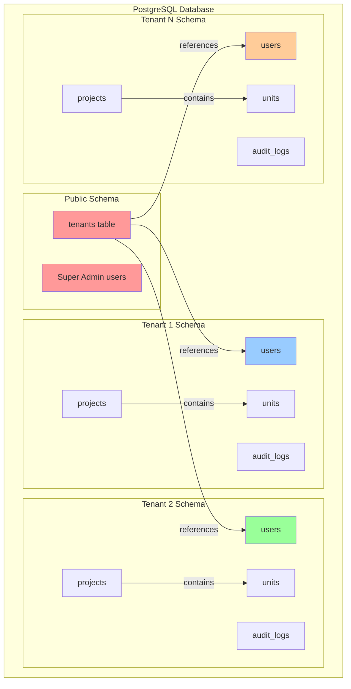
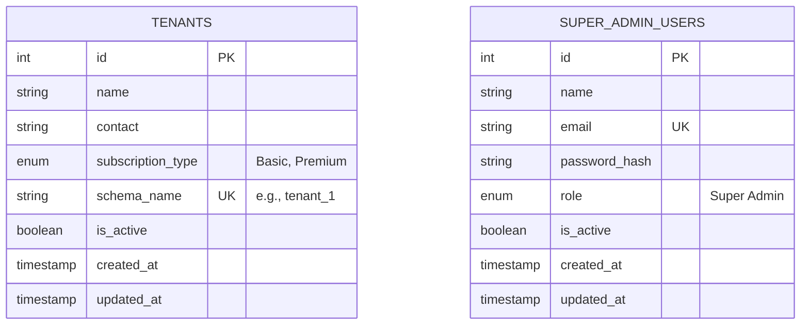
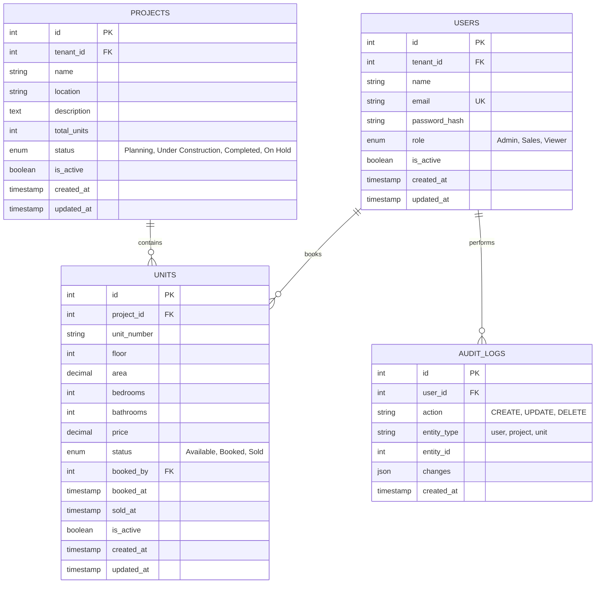
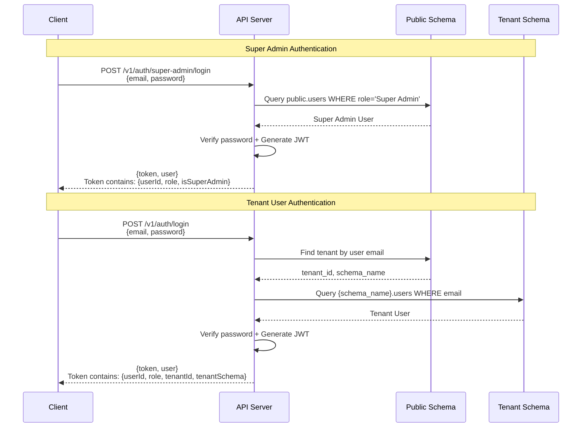
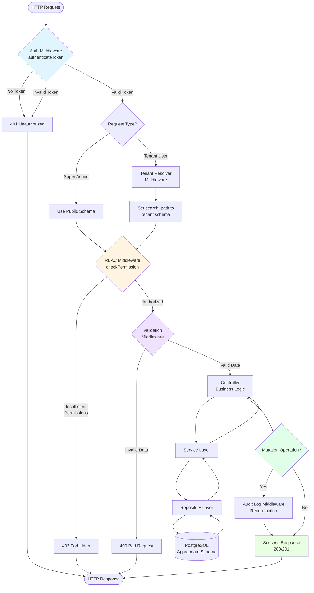
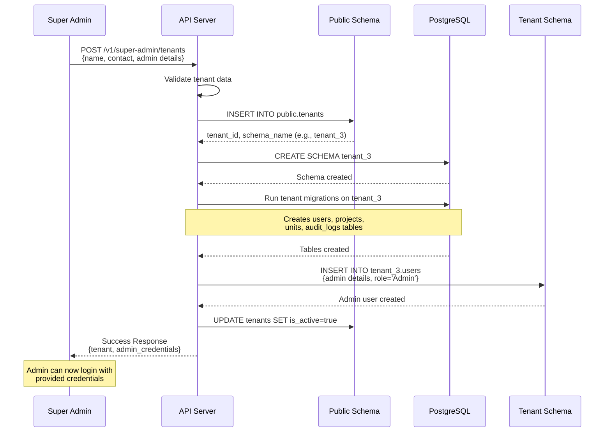
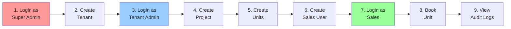

# Housingram API - Architecture & System Design Documentation

> **Note:** For detailed API endpoint documentation, request/response formats, and interactive testing, please visit the [Swagger Documentation](http://localhost:3000/api-docs) (or [Production API Docs](https://real-estate-multi-tenant-api.onrender.com/api-docs)).

---

## Table of Contents
- [Architecture Overview](#architecture-overview)
- [Multi-Tenant Strategy](#multi-tenant-strategy)
- [Database Schema](#database-schema)
- [Authentication Flow](#authentication-flow)
- [Request Processing Flow](#request-processing-flow)
- [Role-Based Access Control](#role-based-access-control)
- [Quick Start Guide](#quick-start-guide)

---

## Architecture Overview

Housingram is a **multi-tenant property management system** designed for real estate builders/developers to manage their projects, units, and sales teams independently with complete data isolation.

### Key Design Principles

1. **Schema-per-Tenant Isolation**: Each tenant (builder) gets a dedicated PostgreSQL schema
2. **Repository Pattern**: Clean separation between data access and business logic
3. **DTO Pattern**: Input validation and output transformation
4. **Middleware Chain**: Layered security and request processing
5. **Audit Logging**: Complete audit trail of all data mutations

### Technology Stack

```
Runtime:        Node.js 18+
Framework:      Express.js
Database:       PostgreSQL 15+ (with Sequelize ORM)
Authentication: JWT (JSON Web Tokens)
Security:       bcryptjs, RBAC middleware
Validation:     Joi schemas
Documentation:  Swagger/OpenAPI 3.0
Logging:        Winston with daily rotation
Migrations:     Umzug
Containerization: Docker & Docker Compose
```

---

## Multi-Tenant Strategy

### Schema-per-Tenant Architecture



### Why Schema-per-Tenant?

✅ **Complete Data Isolation**: No risk of cross-tenant data leaks  
✅ **Performance**: Queries don't need tenant filters, indexes are smaller  
✅ **Flexibility**: Each tenant can have custom schema modifications if needed  
✅ **Compliance**: Easier to meet data residency and privacy requirements  
✅ **Backup & Restore**: Can backup/restore individual tenant data  

---

## Database Schema

### Public Schema

The public schema stores tenant metadata and Super Admin users.



### Tenant Schema

Each tenant has an isolated schema with the following structure:



### Key Relationships

- **Projects → Units**: One-to-Many (CASCADE on delete)
- **Users → Units**: One-to-Many (for bookings)
- **Users → Audit Logs**: One-to-Many (tracking actions)

---

## Authentication Flow

### Two Separate Authentication Paths



### JWT Token Structure

**Super Admin Token:**
```json
{
  "userId": 1,
  "email": "superadmin@housingram.com",
  "role": "Super Admin",
  "isSuperAdmin": true,
  "iat": 1234567890,
  "exp": 1234654290
}
```

**Tenant User Token:**
```json
{
  "userId": 5,
  "email": "admin@acmebuilders.com",
  "role": "Admin",
  "tenantId": 1,
  "tenantSchema": "tenant_1",
  "iat": 1234567890,
  "exp": 1234654290
}
```

---

## Request Processing Flow

### Complete Request Lifecycle



### Middleware Chain Details

1. **Authentication Middleware** (`auth.js`)
   - Verifies JWT token from Authorization header
   - Decodes user information and attaches to `req.user`
   - Rejects invalid/expired tokens

2. **Tenant Resolver Middleware** (`tenantResolver.js`)
   - Extracts tenant schema from JWT token
   - Sets PostgreSQL `search_path` to tenant schema
   - Ensures queries execute in correct schema

3. **RBAC Middleware** (`rbac.js`)
   - Checks if user role has permission for the resource/action
   - Uses permission matrix defined in `config/roles.js`
   - Returns 403 if unauthorized

4. **Validation Middleware** (`validate.js`)
   - Validates request body, params, and query using Joi schemas
   - Returns detailed validation errors
   - Prevents malformed data from reaching controllers

5. **Audit Logger Middleware** (`auditLogger.js`)
   - Records all CREATE, UPDATE, DELETE operations
   - Captures user context, action type, entity, and changes
   - Stores in `{tenant_schema}.audit_logs`

---

## Role-Based Access Control

### User Roles & Permissions Matrix

| Resource | Action | Super Admin | Tenant Admin | Sales | Viewer |
|----------|--------|-------------|--------------|-------|--------|
| **Tenants** | Create | ✅ | ❌ | ❌ | ❌ |
| **Tenants** | Read | ✅ | ❌ | ❌ | ❌ |
| **Tenants** | Update | ✅ | ❌ | ❌ | ❌ |
| **Tenants** | Activate/Deactivate | ✅ | ❌ | ❌ | ❌ |
| **Users** | Create | ❌ | ✅ | ❌ | ❌ |
| **Users** | Read | ❌ | ✅ | ✅ | ✅ |
| **Users** | Update | ❌ | ✅ | ❌ | ❌ |
| **Users** | Delete | ❌ | ✅ | ❌ | ❌ |
| **Projects** | Create | ❌ | ✅ | ❌ | ❌ |
| **Projects** | Read | ❌ | ✅ | ✅ | ✅ |
| **Projects** | Update | ❌ | ✅ | ❌ | ❌ |
| **Projects** | Delete | ❌ | ✅ | ❌ | ❌ |
| **Units** | Create | ❌ | ✅ | ❌ | ❌ |
| **Units** | Read | ❌ | ✅ | ✅ | ✅ |
| **Units** | Update | ❌ | ✅ | ❌ | ❌ |
| **Units** | Book | ❌ | ✅ | ✅ | ❌ |
| **Units** | Delete | ❌ | ✅ | ❌ | ❌ |
| **Audit Logs** | Read | ❌ | ✅ | ✅ | ❌ |

### Role Descriptions

**🔴 Super Admin** (Public Schema)
- Platform administrator
- Onboards new tenants (builders)
- Views cross-tenant statistics
- Activates/deactivates tenant accounts
- **Cannot** access tenant-specific data

**🔵 Admin** (Tenant Schema)
- Full control within their tenant
- Manages users (Sales, Viewers)
- CRUD operations on projects and units
- Views audit logs
- Assigns units to sales team

**🟢 Sales** (Tenant Schema)
- Views all projects and units
- Books available units
- Views audit logs
- **Cannot** create/modify projects or users

**🟡 Viewer** (Tenant Schema)
- Read-only access to projects and units
- Cannot perform any mutations
- Useful for stakeholders, investors, etc.

---

## Tenant Onboarding Flow

### Creating a New Tenant (Builder)



### Automatic Schema Provisioning

When a new tenant is created:
1. Record inserted in `public.tenants` table
2. New PostgreSQL schema created (e.g., `tenant_3`)
3. All tenant migrations executed on new schema
4. Admin user created in tenant schema
5. Credentials returned to Super Admin

---

## Quick Start Guide

### Prerequisites

- Docker & Docker Compose (recommended)
- OR Node.js 18+ and PostgreSQL 15+

### Setup in 3 Steps

**1. Start the Application**
```bash
docker-compose up -d
```

**2. Run Migrations & Seed Data**
```bash
docker-compose exec app npm run migrate:public
docker-compose exec app npm run seed:super-admin
```

**3. Access the Application**

| Service | URL |
|---------|-----|
| API | http://localhost:3000 |
| **Swagger API Docs** | http://localhost:3000/api-docs |
| Production API | https://real-estate-multi-tenant-api.onrender.com |
| Production Docs | https://real-estate-multi-tenant-api.onrender.com/api-docs |

### Default Super Admin Credentials

For development/testing:
- **Email:** `superadmin@housingram.com`
- **Password:** `SuperAdmin@123`

> ⚠️ **Change these credentials immediately in production!**

---

## Testing Workflow Example

### Complete End-to-End Test



### Step-by-Step Testing

1. **Login as Super Admin** → Use default credentials
2. **Create Tenant** → POST `/v1/super-admin/tenants`
3. **Login as Tenant Admin** → Use credentials returned in step 2
4. **Create Project** → POST `/v1/projects`
5. **Create Units** → POST `/v1/units` (link to project)
6. **Create Sales User** → POST `/v1/users` with role "Sales"
7. **Login as Sales User** → GET sales user token
8. **Book a Unit** → POST `/v1/units/:id/book`
9. **View Audit Logs** → GET `/v1/audit-logs`

> 💡 **Tip:** Use [Swagger UI](http://localhost:3000/api-docs) for interactive testing with pre-filled examples!

---

## Additional Documentation

- **[README.md](./README.md)** - Setup, installation, and getting started
- **[Swagger API Docs](http://localhost:3000/api-docs)** - Interactive API reference
- **[DEPLOYMENT.md](./DEPLOYMENT.md)** - Production deployment guide
- **[LOGGING_GUIDE.md](./LOGGING_GUIDE.md)** - Winston logging configuration
- **[POSTMAN_TESTING_GUIDE.md](./POSTMAN_TESTING_GUIDE.md)** - Postman collection usage

---

## Security Features

✅ JWT-based stateless authentication  
✅ Bcrypt password hashing (10 salt rounds)  
✅ Role-based access control (RBAC)  
✅ Schema-level data isolation  
✅ Comprehensive audit logging  
✅ Input validation (Joi schemas)  
✅ SQL injection protection (parameterized queries)  
✅ Token expiration and refresh mechanism  

---


